# Evidencias

## Despliegue
1. Despliegue del backend (microservicios y base de datos):

- Descarga imagen y despliega contenedores:

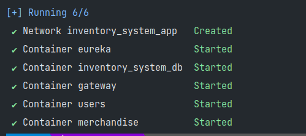

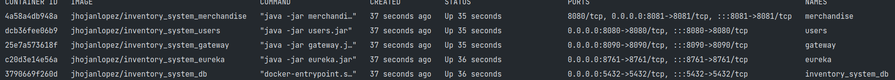

2. Despliegue del frontend:

- Instalacion de dependencias y despliegue:

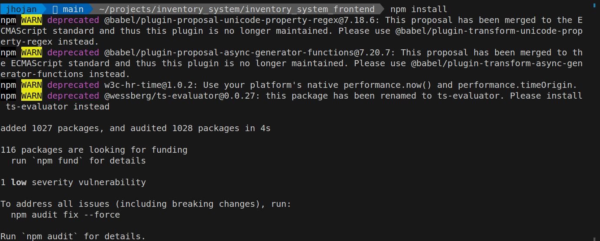

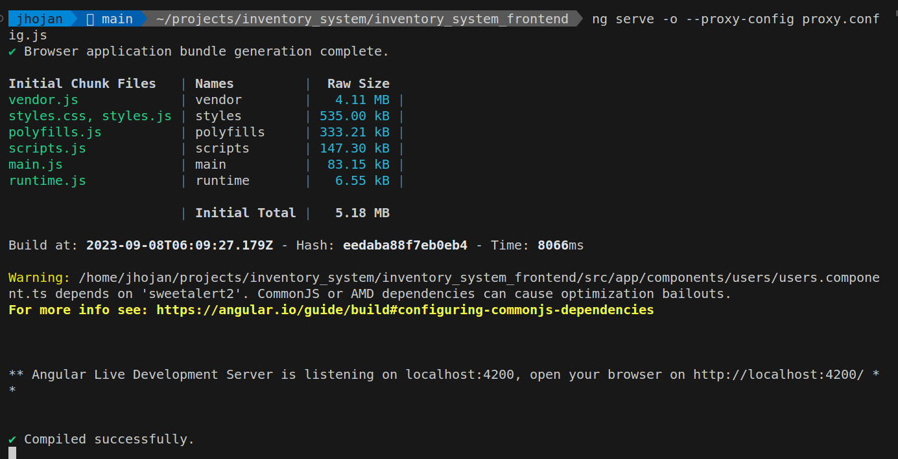

## Funcionalidades

1. Ingresar al sistema, para ello, segun los usuarios predeterminados que se crearon en la base de datos, se puede seleccionar
con cual queremos ingresar:

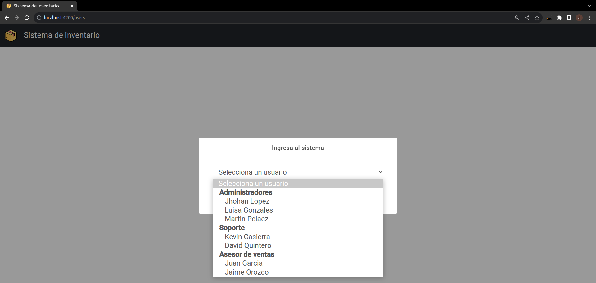

2. Entramos al sistema, aqui podremos ver el listado de la mercancia default que viene en la base de datos y gestionarla,
tambien podemos seleccionar otro usuario:

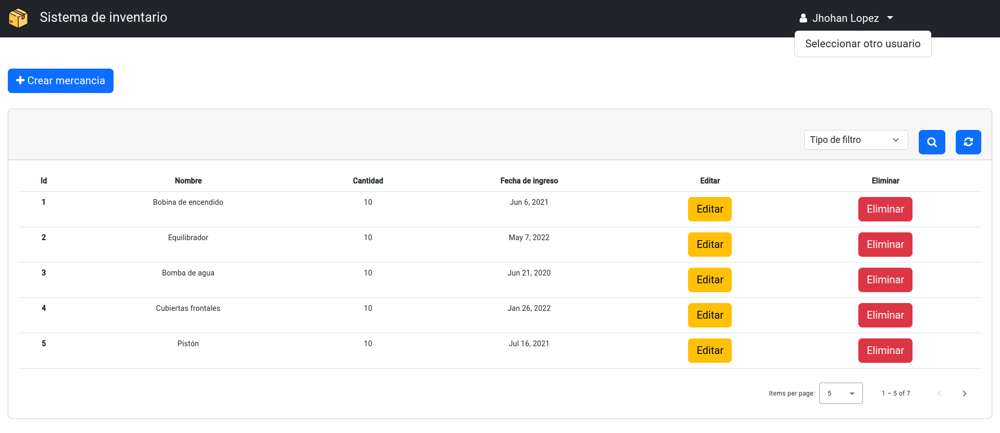

3. Visualizacion de la mercancia, donde podemos traer con paginacion la mercancia y filtrarla ya sea por id o por coincidencia
de nombre, tambien podemos restaurar el listado como viene de manera default:

- filtro por id:

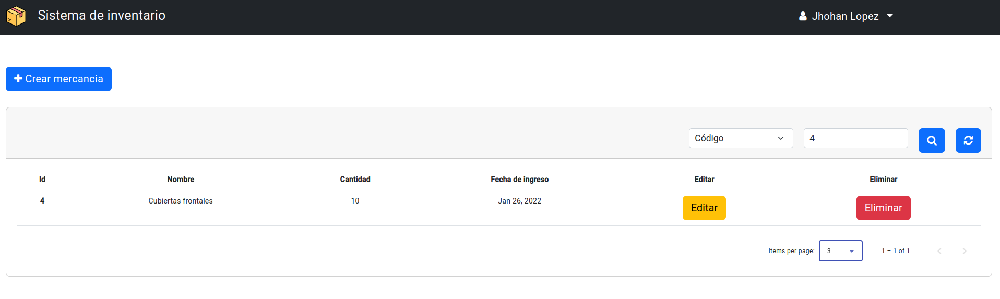

- filtro por coincidencia de nombre:

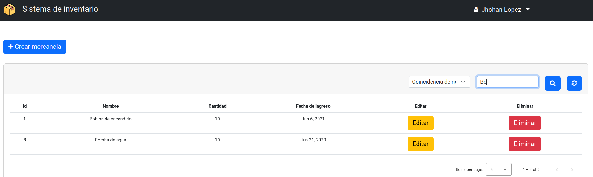

4. Crear mercancia:

- Flujo correcto:

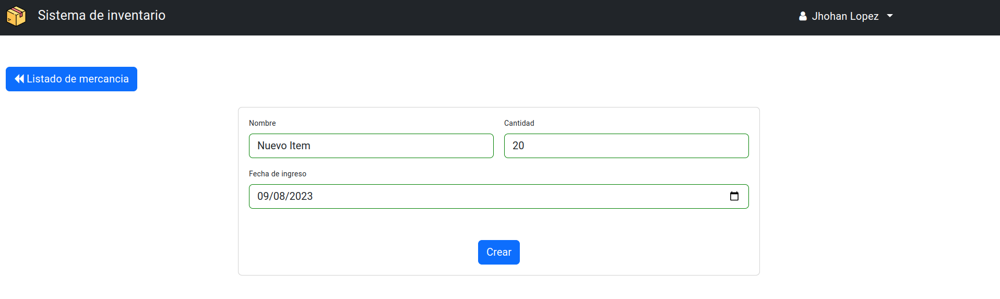

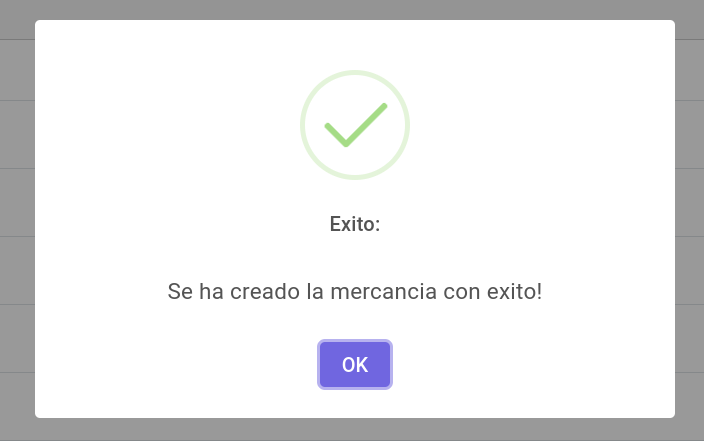

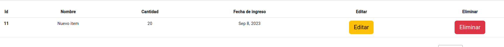

- Flujo incorrecto se tuvieron en cuenta validaciones:

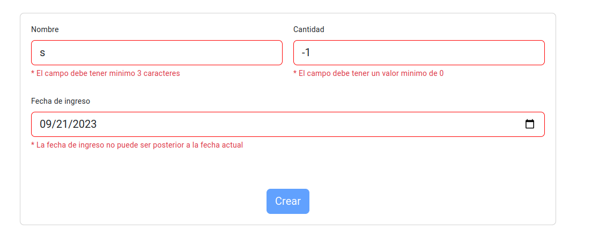

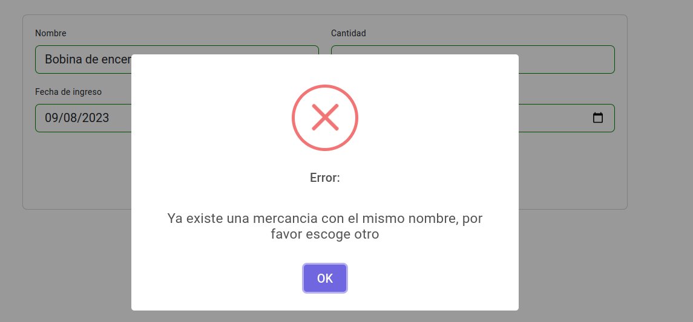

5. Ver detalle y actualizar mercancia (opcion editar), se tuvieron en cuenta las mismas validaciones de creacion:

- Flujo correcto:

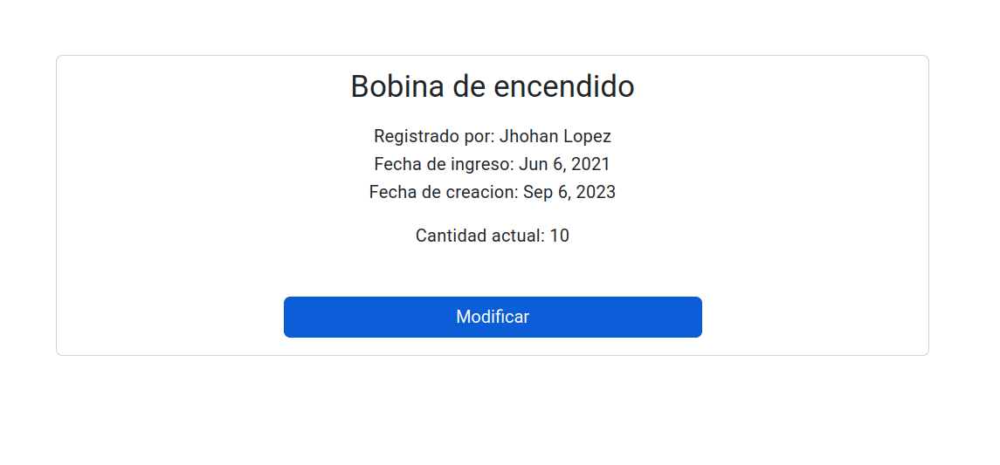

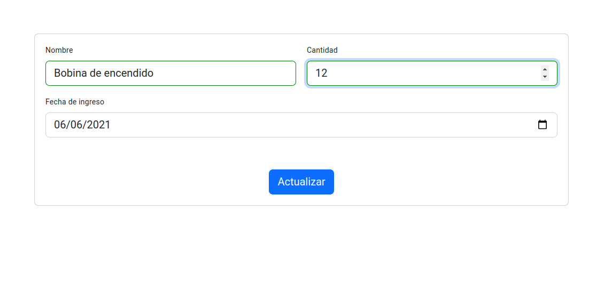

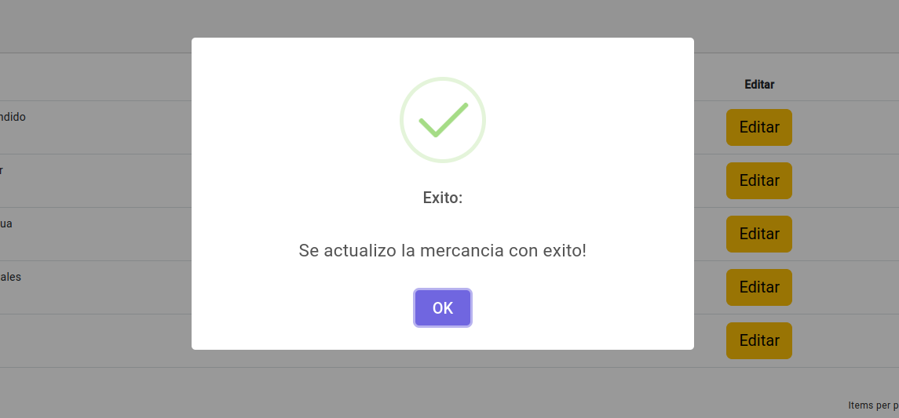

- Flujo incorrecto:

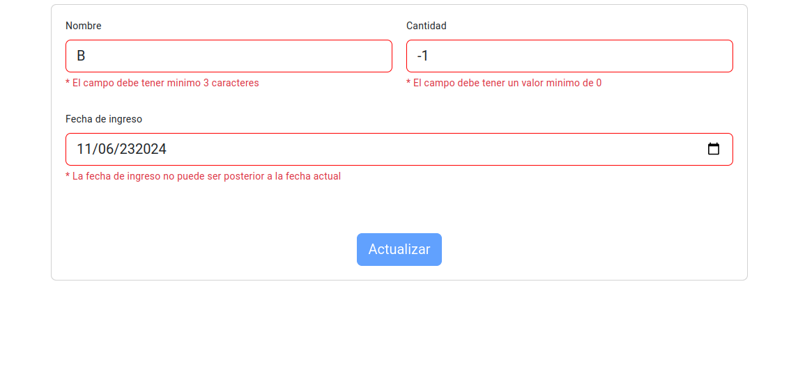

6. Eliminar, se tuvo en cuenta que solo puede eliminar quien creo la mercancia:

- Flujo correcto:

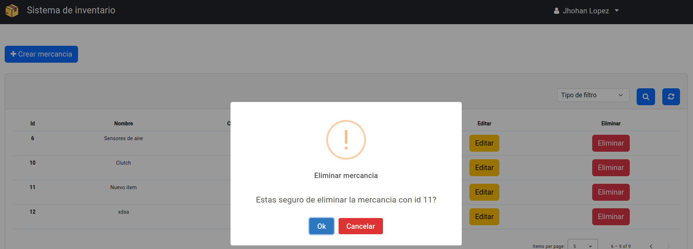

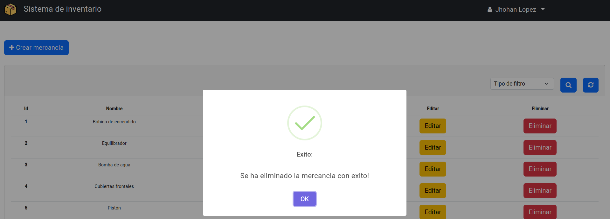

- Flujo incorrecto: 

como ejemplo intentamos eliminar el producto recien creado por mi usuario jhohan lopez con otro usuario:

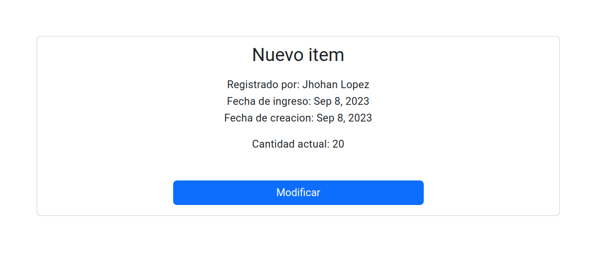

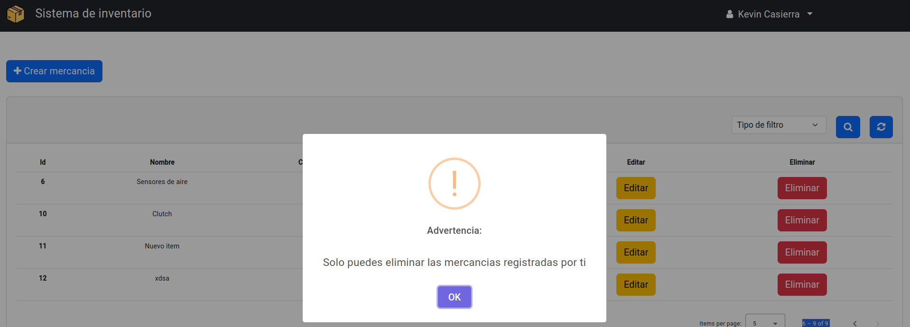

De manera general estas son las funcionalidades del sistema, igualmente invito a su despliegue con la guia en el [README.md](..%2FREADME.md).